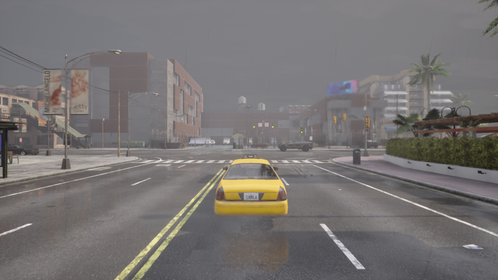

# DLSS

This repository is implementation of the ["Image Super-Resolution Using Deep Convolutional Networks"](https://arxiv.org/abs/1501.00092).
and based on ["a github source for educational purpose only"](https://github.com/yjn870/SRCNN-pytorch)
then fined tuned for our specific application
<center></center>

## Differences from the original

- Added the zero-padding
- Used the Adam instead of the SGD
- Removed the weights initialization

## Requirements

- PyTorch 1.0.0
- Numpy 1.15.4
- Pillow 5.4.1
- h5py 2.8.0
- tqdm 4.30.0

## Train

Dataset provided by Carla, and use `prepare_bis.py` to create .h5 file.

## Carla 
We focus on 4 type of data : High_resolution images, Segmentation maps, Optical flow and depth

We added the recording of depth maps which will be useful during the training phase; they allow the model to give more importance to “near” pixels and less importance to distant pixels.

In order to have a quality dataset we wrote a program which counts the number of black pixels in the optical flow images, i.e. the pixels which have not moved from one frame to the next, if the number of these pixels exceeds the value 1_500_000 the program deletes the image and all the corresponding images in the other files and like this we will have optical flow images which carry “information” in order to help the model to increase the resolution.

-We have already recorded 1719 images (in each modality) which are taken at the same moment, to ensure this last point, we displayed for each image the frame in which it was recorded, and we noticed that they are all recorded in the same frame. We also tried to visually test the alignment between the different modalities by superimposing them and reducing the transparency, and we checked their correspondence.


## Test


```bash
python test.py --weights-file ".pth file" \
               --image-file "image file" \
               --scale 2
```

## Results

| Eval. Mat | Scale | SRCNN | SSIM |
|-----------|-------|-------|--------------|
| PSNR | 2 | 42.16 | 0.9814 |
| PSNR | 3 | 38.61 | 0.9564 |
| PSNR | 4 | 37.11 | 0.9413 |

tests are still ongoing ...


<table>
    <tr>
        <td><center>Original</center></td>
        <td><center>BICUBIC x2</center></td>
        <td><center>SRCNN x2 (42.16 dB)</center></td>
    </tr>
    <tr>
    	<td>
    		<center></center>
    	</td>
    	<td>
    		<center></center>
    	</td>
    	<td>
    		<center></center>
    	</td>
    </tr>
    <tr>
        <td><center>Original</center></td>
        <td><center>BICUBIC x3</center></td>
        <td><center>SRCNN x3 (38.61 dB)</center></td>
    </tr>
    <tr>
    	<td>
    		<center></center>
    	</td>
    	<td>
    		<center></center>
    	</td>
    	<td>
    		<center></center>
    	</td>
    </tr>
    <tr>
        <td><center>Original</center></td>
        <td><center>BICUBIC x4</center></td>
        <td><center>SRCNN x4 (37.11 dB)</center></td>
    </tr>
    <tr>
    	<td>
    		<center></center>
    	</td>
    	<td>
    		<center></center>
    	</td>
    	<td>
    		<center></center>
    	</td>
    </tr>
</table>
